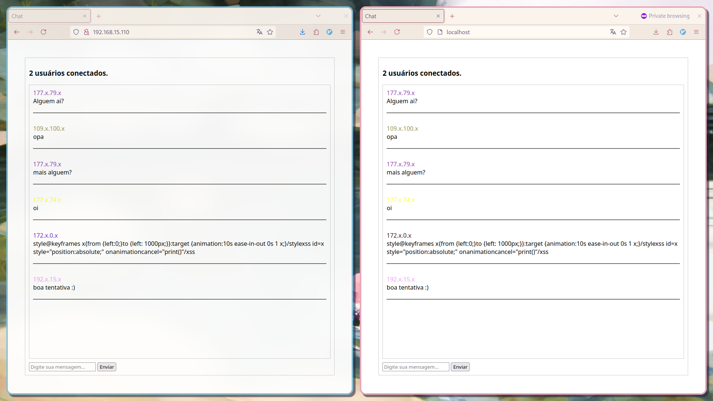

# Go-Anon-Chat

Um chat anônimo em tempo real construído com Go, WebSockets, MySQL/MariaDB e Docker.

## Sobre o Projeto

Go-Anon-Chat é uma aplicação de chat web segura que permite aos usuários se comunicarem anonimamente em tempo real. Desenvolvida com Go no backend e JavaScript puro no frontend, esta aplicação utiliza Docker tornando-a replicável e facilitando a configuração em diferentes ambientes.



[Baixar vídeo de demonstração](demo.mp4)

### Características Principais

- **Chat Anônimo**: Os usuários podem conversar sem necessidade de registro ou login.
- **Identificação por Cores**: Cada usuário é identificado por uma cor única baseada no hash MD5 de seu IP para fácil identificação visual.
- **WebSockets**: Comunicação em tempo real mantendo a privacidade.
- **Persistência de Mensagens**: Todas as mensagens são armazenadas em um banco de dados e são exibidas para os próximos visitantes.
- **Sanitização de Mensagens**: Proteção contra SQL Injection e Cross-Site Scripting (XSS).
- **Contagem de Usuários em Tempo Real**: Exibe o número atual de usuários conectados.

### Tecnologias Utilizadas

- **Backend**: Go, [sqlc](https://sqlc.dev/)
- **Frontend**: HTML, CSS, JavaScript (Vanilla)
- **WebSockets**: github.com/coder/websocket
- **Banco de Dados**: MariaDB

A aplicação utiliza o **SQLC** para gerar código Go tipado a partir de queries SQL, facilitando a interação com o banco de dados de maneira segura.

## Como Utilizar

1. **Clone o repositório**:
   ```sh
   git clone https://github.com/seu-usuario/go-anon-chat.git
   cd go-anon-chat
   ```

2. **Configure o arquivo ```.env```**:
   Utilize o arquivo ```.env``` na raiz do projeto e altere as variáveis de ambiente se necessário, como a porta da aplicação ou do banco de dados.
   
5. **Suba os contêineres com Docker Compose**:
   Execute o comando para iniciar os serviços da aplicação (backend e banco de dados):
   ```sh
   docker-compose up --build
   ```
   
6. **Acesse a aplicação**: Abra o navegador e vá para ```http://ip_da_sua_maquina:8080``` para acessar o chat.
